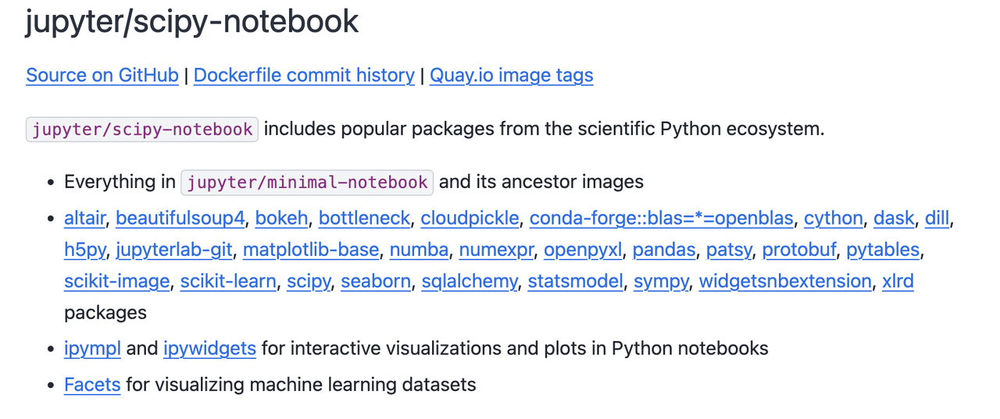
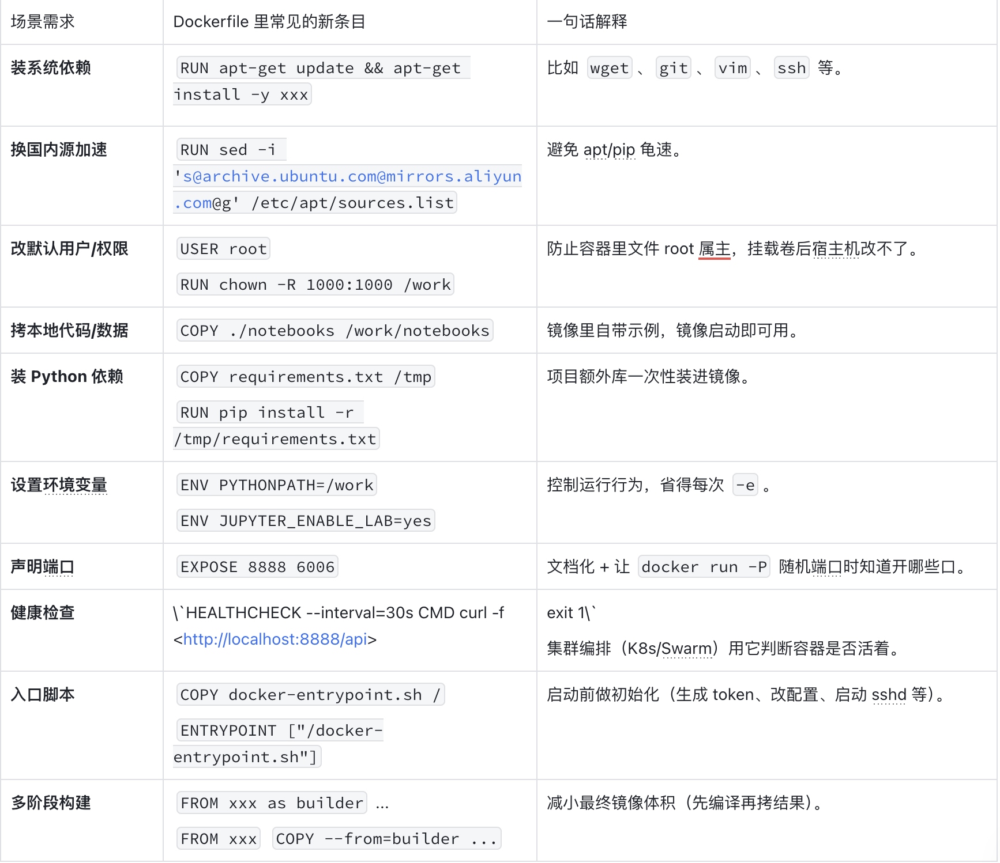
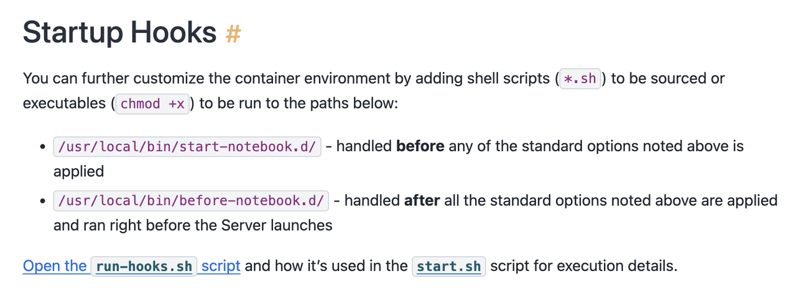
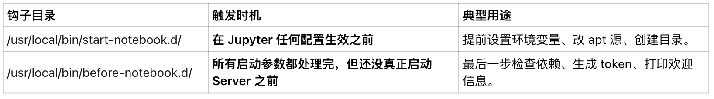

## Jupyter Docker Stacks 
Jupyter Docker Stacks是Jupyter官方的镜像库，可以实现如下功能：
- 使用 JupyterLab 前端启动个人 Jupyter 服务器（默认）
- 使用 JupyterHub 为团队运行 JupyterLab
- 在本地 Docker 容器中使用 Jupyter Notebook 前端启动个人 Jupyter 服务器
- 编写自己的项目 Dockerfile


```shell
docker run -it --rm -p 10000:8888 -v "${PWD}":/home/jovyan/work quay.io/jupyter/datascience-notebook:2025-03-14
# --rm 在容器退出时自动清理容器并删除文件系统
# -v 将当前工作目录挂载到主机上（${PWD}在示例命令中），就像/home/jovyan/work在容器中一样。服务器日志将显示在终端中。
```

https://jupyter-docker-stacks.readthedocs.io/en/latest/using/selecting.html
选择具体的镜像，其中有每个镜像中的都预装了哪些包的介绍。



https://github.com/jupyter/docker-stacks/tree/main/images/scipy-notebook

常见的Dockerfile要考虑的内容：



- 本地单机跑实验：FROM + WORKDIR 就够了。
- 团队共享镜像：至少加 COPY + RUN pip install + EXPOSE。
- 上生产/CI：再补 USER+chown、HEALTHCHECK、ENTRYPOINT、多阶段。

一些配置选项:
https://jupyter-docker-stacks.readthedocs.io/en/latest/using/common.html




官方镜像给你留了 2 个“钩子文件夹”。你只要把脚本或程序扔进去，容器启动时就会自动帮你执行，不用改任何源码。



官方把社区用户‘玩出花’来的实战技巧收集起来，放在文档里，大家可以直接抄作业：
https://jupyter-docker-stacks.readthedocs.io/en/latest/using/recipes.html